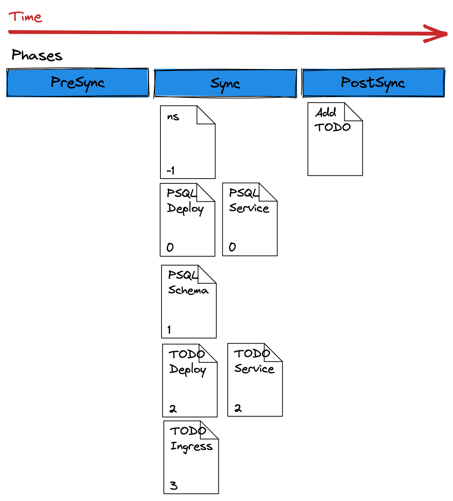

# ArgoCD Demo on OpenShift
**1. Setup**
- Prerequisite CLI Tools
- Download Source Files
- Setup OpenShift Cluster
- Install OpenShift GitOps Operator

**2. Getting Started**
- Connecting to Argo CD
  - Connecting with the CLI
  - Connecting with the Web Console
- Deploy a Sample Application
  - Review the Application Manifests
  - Deploy the Application
  - Addressing Configuration Drift

**3. Work with Kustomize**
- Exploring Kustomize
- Exploring the Kustomize CLI
  - Exploring Kustomize with Kubectl
- Deploying Kustomized Application
  - The Argo CD Web Console
  - Kustomized Application

**4. Sync Waves and Hooks**
- Using Sync Waves
  - Exploring the Manifests
- Exploring Resource Hooks
  - Exploring Manifests
  - Deploying The Application

## 1. Setup
**Prerequisite CLI Tools**
1. install git
```
sudo dnf install git
```
2. install argocd
```
wget https://github.com/argoproj/argo-cd/releases/download/v2.0.0/argocd-linux-amd64
chmod +x argocd-linux-amd64 
sudo mv argocd-linux-amd64 /usr/local/bin/argocd
```
3. install kubectl
```
wget https://github.com/kubernetes-sigs/kustomize/releases/download/kustomize%2Fv4.1.2/kustomize_v4.1.2_linux_amd64.tar.gz

tar -zxvf kustomize_v4.1.2_linux_amd64.tar.gz 
sudo mv kustomize /usr/local/bin/
rm -rf kustomize_v4.1.2_linux_amd64.tar.gz 
```
4. install jq
```
wget https://github.com/stedolan/jq/releases/download/jq-1.6/jq-linux64
chmod +x jq-linux64
sudo mv jq-linux64 /usr/local/bin/jq
```
5. install yq
```
wget https://github.com/mikefarah/yq/releases/download/2.4.1/yq_linux_amd64
chmod +x yq_linux_amd64
sudo mv yq_linux_amd64 /usr/local/bin/yq
```

**Download Source Files**
```
git clone https://github.com/redhat-scholars/argocd-tutorial.git gitops
```
```
export TUTORIAL_HOME="$(pwd)/gitops"
```
```
cd $TUTORIAL_HOME
```

**Setup OpenShift Cluster**
1. login into the OpenShift cluster using `oc login`
```
oc version
```
**Install OpenShift GitOps Operator**
1. Install OpenShift GitOps Operator

2. Give the ServiceAccount for ArgoCD the ability to manage the cluster
```
oc adm policy add-cluster-role-to-user cluster-admin -z openshift-gitops-argocd-application-controller -n openshift-gitops
```

## 2. Getting Started
**Connecting to Argo CD**
1. get credentials and cli-login
```
argoPass=$(oc get secret/openshift-gitops-cluster -n openshift-gitops -o jsonpath='{.data.admin\.password}' | base64 -d)
echo $argoPass
```
```
argoURL=$(oc get route openshift-gitops-server -n openshift-gitops -o jsonpath='{.spec.host}{"\n"}')
echo $argoURL
```
```
argocd login --insecure --grpc-web $argoURL  --username admin --password $argoPass
```
2. get route and gui-login
```
oc get route openshift-gitops-server -n openshift-gitops -o jsonpath='{.spec.host}{"\n"}'
```

**Deploy a Sample Application**

1. Review the ArgoCD Application
```
cd gitops
cat documentation/modules/ROOT/examples/bgd-app/bgd-app.yaml
```
2. Review the Application Manifests

https://github.com/redhat-developer-demos/openshift-gitops-examples/tree/main/apps/bgd/overlays/bgd

3. Deploy the application
```
oc apply -f documentation/modules/ROOT/examples/bgd-app/bgd-app.yaml
```
4. Verify the resources are created
```
oc get all -n bgd
```
5. Verify the rollout is complete
```
oc rollout status deploy/bgd -n bgd
```
6. Obtain the URL and check app in a web browser
```
oc get route bgd -n bgd -o jsonpath='{.spec.host}{"\n"}'
```

**Addressing Configuration Drift**

1. patch the deployment
```
oc -n bgd patch deploy/bgd --type='json' -p='[{"op": "replace", "path": "/spec/template/spec/containers/0/env/0/value", "value":"green"}]'
```
2. Verify rollout is complete 
```
kubectl rollout status deploy/bgd -n bgd
```
3. Refresh the browser tab and verify the change
```
oc get route bgd -n bgd -o jsonpath='{.spec.host}{"\n"}'
```
4. Check ArgoCD WebUI and verify that the app is `Out of Sync`

5. Correct configuration drift manually

Through GUI:
```
  Click SYNC > Click Synchronize
```
or through CLI:
```
argocd app sync bgd-app
```
6. Correct configuration drift automatically
```
oc patch application/bgd-app -n openshift-gitops --type=merge -p='{"spec":{"syncPolicy":{"automated":{"prune":true,"selfHeal":true}}}}'
```
7. From GUI change Replica Count and verify the sync

## 3. Work with Kustomize

**Exploring the Kustomize CLI**

1. Verify kustomize has been installed
```
kustomize version --short
```
2. Change directory
```
cd documentation/modules/ROOT/examples/kustomize-build
```
3. view the deployment file 
```
cat welcome.yaml
```
4. view kustomization file and check label and image
```
cat kustomization.yaml
```
5. Build the manifest
```
kustomize build .
```
6. Veriy the deployment file has a new label and container image has been changed

**Exploring Kustomize with Kubectl**
1. Create the project
```
oc new-project kustomize-test
```
2. Build and apply manifests
```
kubectl apply -k ./
```
3. Check pods
```
kubectl get pods -n kustomize-test
```
4. Check Deployment Labels
```
kubectl get deployment welcome-php -o jsonpath='{.metadata.labels}' | jq -r
```
5. Check Image tag
```
kubectl get deploy welcome-php  -o jsonpath='{.spec.template.spec.containers[].image}{"\n"}'
```
6. Delete the project
```
oc delete project kustomize-test
```

**Deploying Kustomized Application**
1. Change Directory

```
cd ../../../../../
```
2. Review the application
```
cat documentation/modules/ROOT/examples/bgdk-app/bgdk-app.yaml
```
3. Review the kustomization file
```
https://github.com/redhat-developer-demos/openshift-gitops-examples/tree/main/apps/bgd/overlays/bgdk
```
4. Deploy the application
```
kubectl apply -f documentation/modules/ROOT/examples/bgdk-app/bgdk-app.yaml

```
5. Check the application from route

## 4. Sync Waves and Hooks

**Using Sync Waves to order deployment**

Examples:

```
metadata:
  annotations:
    argocd.argoproj.io/sync-wave: "2"
```

```
metadata:
  annotations:
    argocd.argoproj.io/sync-wave: "-5"
```

**Exploring Resource Hooks**

Example:

```
metadata:
  annotations:
    argocd.argoproj.io/hook: PreSync
```

- **PreSync** - Runs before the sync operation. This can be something like a database backup before a schema change

- **Sync** - Runs after PreSync has successfully ran. This will run alongside your normal manifests.

- **PostSync** - Runs after Sync has ran successfully. This can be something like a Slack message or an email notification.

- **SyncFail** - Runs if the Sync operation as failed. This is also used to send notifications or do other evasive actions.

Example:

```
metadata:
  annotations:
    argocd.argoproj.io/hook: PostSync
    argocd.argoproj.io/hook-delete-policy: HookSucceeded
```

- **HookSucceeded** - The resource will be deleted after it has succeeded.

- **HookFailed** - The resource will be deleted if it has failed.

- **BeforeHookCreation** - The resource will be deleted before a new one is created (when a new sync is triggered).

**Exploring Manifests**

1. Review the job file
```
cat documentation/modules/ROOT/examples/todo-yaml/todo-insert-data.yaml
```

2. Review the execution order


3. Review the application yaml
```
cat documentation/modules/ROOT/examples/todo-yaml/todo-insert-data.yaml
```

4. Review all files
```
https://github.com/redhat-developer-demos/openshift-gitops-examples/tree/main/apps/todo
```

5. Apply manifests
```
kubectl apply -f documentation/modules/ROOT/examples/todo-yaml/todo-application.yaml
```

6. Check GUI and click on the card

7. Check if the job is finished and deleted
```
kubectl get pods -n todo
```

8. Get route and check application for resource hook

todo.html
```
oc get route
```

